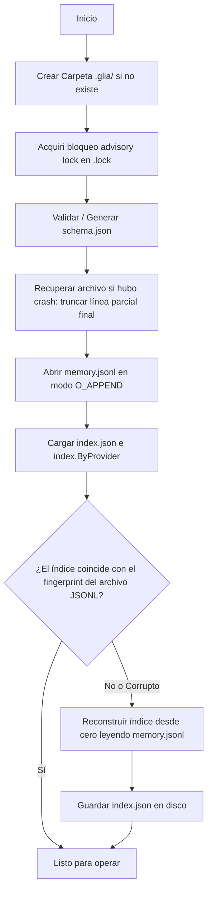

# Arquitectura del Sistema y Flujo de Datos

Este documento detalla el diseño de software de `glia`, la distribución de responsabilidades de sus paquetes en Go y los flujos de ejecución a bajo nivel para lectura, escritura y sincronización.

---

## 🗂️ 1. Estructura de Paquetes y Responsabilidades

El proyecto está diseñado bajo un modelo modular que restringe las dependencias circulares. La dirección de importación fundamental es:
`cmd` ──► `internal/sync` ──► `internal/adapter` y `internal/store`

### Paquete `cmd/glia` (Cobra CLI)
Ubicación: [cmd/glia](../cmd/glia)
- Define la interfaz de línea de comandos para el usuario final.
- **Comandos Clave**:
  - `init`: Inicializa un store vacío y bootstrapea el archivo de configuración.
  - `status`: Muestra la salud de los proveedores y si hay conflictos pendientes de resolución.
  - `sync`: Ejecuta la sincronización bidireccional y gatilla opcionalmente el autocommit de Git.
  - `resolve`: Permite resolver un conflicto manualmente seleccionando un índice duplicado.
  - `tui`: Inicia la interfaz interactiva Bubble Tea.

### Paquete `internal/store` (Motor de Persistencia)
Ubicación: [internal/store](../internal/store)
- Administra los archivos en disco (`memory.jsonl`, `index.json`, `schema.json`, `.lock`).
- Implementa la lógica transaccional de lectura por offset del índice y escritura batch con fsync.
- Detecta colisiones físicas durante el inicio y expone la API para consultar y eliminar conflictos.

### Paquete `internal/adapter` (Contratos de Proveedores)
Ubicación: [internal/adapter](../internal/adapter)
- Define la interfaz común `Adapter` y las estructuras genéricas.
- **Subpaquete `engram`**: Implementa la comunicación con la CLI de Engram mediante ejecuciones de comandos en terminal (`execCommander`) y HTTP client para el daemon local (`httpTransport`).
- **Subpaquete `claudemem`**: Implementa la comunicación HTTP de solo lectura con el daemon de Claude-Mem, con paginación de observaciones nativas y transformación a registros canónicos del tipo `session_summary`.

### Paquete `internal/source/openspec` (Fuente de solo lectura)
Ubicación: [internal/source/openspec](../internal/source/openspec)
- Implementa `adapter.Adapter` para la fuente estática de artefactos SDD (PRD-11).
- **Dirección de importación**: `internal/source/openspec` → `internal/adapter` → `internal/store`. El paquete `internal/store` nunca importa a los adaptadores (restricción arquitectónica).
- `ListNative` recorre el directorio `openspec/` con `filepath.WalkDir` y devuelve los paths relativos de todos los `.md` encontrados (ordenados, determinísticos).
- `ReadNative` lee el contenido del archivo y su `ModTime`.
- `ToCanonical` convierte cada archivo en un `CanonicalRecord` con `kind: spec_artifact`, derivando el `topic_key` (`sdd/<cambio>/<artefacto>` o `spec/<dominio>`) y el `type` (`proposal | design | tasks | spec`) desde el path relativo.
- `FromCanonical` y `WriteNative` retornan `ErrUnsupported` — la puerta anti-leakage que garantiza que el motor de sync nunca intente escribir en los archivos fuente (D2).
- `WriteCapability()` devuelve `"read-only"`, lo que hace que el motor de sync clasifique esta integración como `Source` en lugar de `Provider` y la muestre en el bloque separado de `glia status`.

### Paquete `internal/sync` (Motor de Sincronización)
Ubicación: [internal/sync](../internal/sync)
- Orquesta las etapas de Pull y Push.
- Evalúa los watermarks del store para sincronizar solo lo nuevo.
- Maneja la lógica de autocommit con comandos del sistema Git.

### Paquete `internal/tui` (Interfaz Interactiva)
Ubicación: [internal/tui](../internal/tui)
- Diseñado sobre el framework Bubble Tea (arquitectura Elm).
- Permite buscar memorias por título/contenido y visualizar detalles, tags y origen de cada registro de forma amigable.

---

## ⚙️ 2. Flujos de Ejecución Detallados

### A. Secuencia de Inicio del Store (`store.Open`)
Cuando cualquier comando de la CLI o la TUI necesita acceder a las memorias, ejecuta `store.Open()`, el cual gatilla una secuencia estricta de 7 pasos:

### B. Flujo de Escritura en Lote (`AppendBatch`)
La escritura de nuevas memorias o actualizaciones se realiza siempre a través de lotes (`AppendBatch`) para garantizar la atonicidad física y durabilidad mediante un único `fsync`:

1. **Clonar Índice**: Se genera una instantánea (clon) del índice actual en memoria.
2. **Pre-validación**: Para cada registro del lote, se computa su `canonical_id`, `line_ulid`, `revision` y `supersedes` en base a la instantánea y se valida la consistencia del esquema (ej. si es una eliminación, que cumpla las reglas de Tombstone).
3. **Escritura en Buffer**: Si todos los registros del lote son válidos, se serializan a JSON y se escriben en el búfer de escritura de 64 KB en memoria (`bufio.Writer`), registrando el byte offset de inicio de cada línea.
4. **Flush y Fsync**: Se vacía el búfer a disco y se invoca `Sync()` sobre el archivo del log (`fsync` del sistema operativo).
5. **Persistir Índice**: Se recalcula el número de líneas, el fingerprint (xxhash) y se guarda `index.json` en disco mediante escritura atómica (creación de archivo temporal + renombrado).

### C. Flujo de Sincronización Completa (`Engine.Sync`)
Cuando se ejecuta `glia sync`, el motor orquesta el siguiente ciclo:

1. **Espejo Engram Inicial**: Si la opción de espejo está activa, se fuerza una sincronización de Engram interna ejecutando `engram sync` en la terminal para asegurar que el daemon local tenga los datos más recientes.
1a. **Ingesta de fuentes estáticas** (si están habilitadas, ej. openspec): el motor llama a `ListNative` + `ReadNative` + `ToCanonical` sobre cada adaptador cuyo `WriteCapability()` devuelva `"read-only"`. Los registros resultantes se insertan en el store canónico exactamente igual que los registros de cualquier proveedor — la diferencia es que el motor nunca intenta hacer push hacia estas fuentes.
2. **PULL (Desde el Store hacia el Proveedor)**:
   - Se obtienen todos los registros vivos del Store Canónico usando `ListLive()`.
   - Para cada proveedor activo, se filtran los registros cuyos tipos de datos no son soportados (ej. Claude-Mem no soporta relaciones).
   - Se consultan los watermarks en `index.json` (`SyncState`).
   - Se seleccionan únicamente los registros modificados después de la última sincronización (`updated_at > last_pulled_at`).
   - Se invoca `WriteNative` en el adaptador para guardar el registro en el daemon local.
   - Si tiene éxito, se asocian los IDs mediante `BindProvider` y se actualiza el timestamp en `SyncState`.
3. **PUSH (Desde el Proveedor hacia el Store Canónico)**:
   - Se invoca `ListNative` en el adaptador para enumerar las claves nativas actualizadas desde `last_pushed_at`.
   - Para cada registro detectado, se lee su detalle con `ReadNative`.
   - Se traduce a formato canónico con `ToCanonical`, mapeando los IDs existentes.
   - Se inserta en el Store usando `AppendBatch`.
4. **Espejo Engram Final**: Se vuelve a ejecutar `engram sync` si aplica.
5. **Git Autocommit**: Si se especificó el flag `--commit`, el motor ejecuta los comandos Git para auto-guardar los archivos modificados bajo `.glia/` en el historial del repositorio.

---

## 🛠️ 3. Puntos Destacados de Diseño Técnico

### Verificación O(1) de Staleness (xxhash)
Para evitar reconstruir el índice de forma innecesaria en cada inicio de la CLI (lo cual ralentizaría la herramienta al crecer el log), el store guarda un hash de control (fingerprint) en `index.json`. 
- **Algoritmo**: `xxhash` sobre los metadatos y fragmentos límite: `hex(xxh64(file_size ++ primer_bloque_4KB ++ último_bloque_4KB))`.
- **Efecto**: Si el archivo de log no cambió, la validación toma menos de 1 milisegundo independientemente del tamaño del archivo.

### Dos Pasos de Decodificación (decodeLine)
Para garantizar la compatibilidad hacia adelante y hacia atrás de los esquemas de datos:
- **Paso 1**: Se realiza un decode mínimo JSON para inspeccionar únicamente el campo `schema_version`. Si la versión de la línea en disco es superior a la soportada por el binario actual de Go (`StoreSupportedVersion`), se descarta la línea silenciosamente para evitar crasheos.
- **Paso 2**: Si la versión es soportada, se decodifica completamente en la estructura de datos `CanonicalRecord`.

### Normalización de Timestamps a Nanosegundos Estables
Dado que las reglas de desempate automático de conflictos ordenan los registros usando comparación léxica directa del campo `updated_at`, es mandatorio que todos los timestamps usen el mismo formato rígido. Los adaptadores limpian y normalizan todos los campos de tiempo usando un formato de **9 dígitos decimales de precisión para nanosegundos con sufijo Z UTC**:
`2006-01-02T15:04:05.000000000Z`
